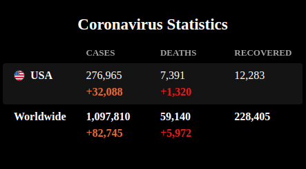

## MMM-VirusStats

### World Health Organization Corona Virus stats for the world and the U.S.

* Don't be hating. It is what it is.

## Example



## Installation

* `git clone https://github.com/mykle1/MMM-VirusStats` into the `~/MagicMirror/modules` directory.

## Config.js entry and options

```
{
    disabled: f,
    module: 'MMM-VirusStats',
    position: 'middle center',
    config: {
      height: "220px", // 160px for just USA // 220px for USA and World // 260px for both and update time
      animationSpeed: 1000,
      updateInterval: 10 * 60 * 1000,
    }
},
```
